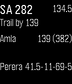
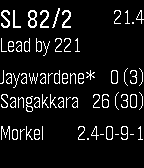
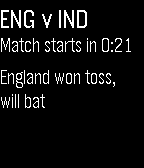

# SixFour

SixFour is a live cricket scoreboard for Pebble watches

## screenshots






## setup

You'll need the [Pebble SDK](https://developer.getpebble.com/).

Clone the app source:

```bash
git clone https://github.com/robn/sixfour.git
cd sixfour
```

Visit [ESPNcricinfo](http://www.espncricinfo.com/) and view the match you want
to display. Extract its six-digit match ID from the URL. Edit
`src/js/pebble-js-app.js` and put this value into the `matchid` variable at the
top.

Then build and install:

```bash
pebble build
pebble install --phone <ip>
```

## todo

- [ ] match chooser via settings
- [ ] multiple matches
- [ ] recent event line
- [ ] handle long names sanely
- [ ] test with limited-overs, four-day, other formats
- [ ] last update time

## credits and license

Copyright (c) 2014 Robert Norris. MIT license. See [LICENSE.md](LICENSE.md)

## disclaimer

This app relies on live match data from
[ESPNcricinfo](http://espncricinfo.com/). This data is exposed to the internet
so that ESPN's own applications can use it, but using it directly is probably a
breach of their [terms of
service](http://www.espncricinfo.com/ci/content/site/company/terms_use.html). I
am *not* responsible for anything that happens to you (eg site ban, legal
action) as a result of using SixFour.

## contributing

Please hack on this and send pull requests :)
